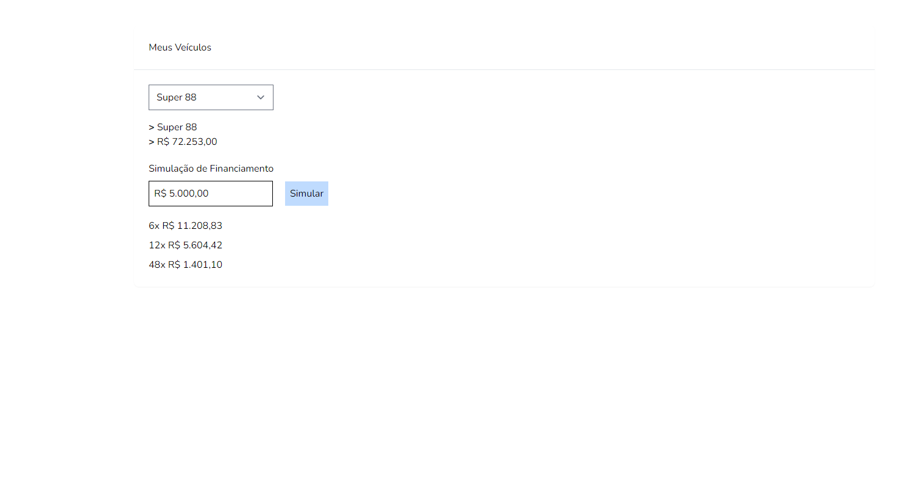

# Teste Listra
### Simulador de Financiamento
Ambiente utilizando [Laravel Sail](https://laravel.com/docs/8.x/sail#main-content)

Tecnologias:
[Laravel](https://laravel.com/)
[Vuejs](https://vuejs.org/)


#### Passos para funcionamento
1. Clone este repositório 
2. Acesse a pasta `cd teste-listra`
3. Execute o comando abaixo para instalar as dependências:
    <br>
    ```
    docker run --rm \
    -u "$(id -u):$(id -g)" \
    -v $(pwd):/var/www/html \
    -w /var/www/html \
    laravelsail/php81-composer:latest \
    composer install --ignore-platform-reqs
    ```
    <br>
4. Inicie o ambiente executando:
    `./vendor/bin/sail up`
    
5. Dentro no container `teste-listra-laravel.test-1` execute os seguintes comandos:
    <br>
    ```
    > php artisan migrate && php artisan db:seed
    > npm install && npm run dev
    ```

### API Routes
 * Listar Veículos `GET http://localhost/api/vehicles`

 * Simular Financiamento `POST http://localhost/api/simulate` 
 Params:
    ```
        {
            "vehicle_id": 12,
            "entry_value": 5000
        }
    ```

### Captura da Aplicação

